# Лабораторная работа №1. Базовая работа с git
**Студент:** Мельник Егор\
**Группа:** 5130201/50001\
**Цель работы:** Познакомиться с базовыми операциями Git.

## Содержание
1. [Установка и настройка](#установка-и-настройка)
2. [Начало работы с новым проектом](#начало-работы-с-новым-проектом)
3. [Отслеживание состояния кода](#отслеживание-состояния-кода)
4. [Откат изменений](#откат-изменений)
5. [Ветвление версий](#ветвление-версий)
6. [Слияние веток, конфликты](#слияние-веток-конфликты)
7. [Работа с удалённым репозиторием](#работа-с-удалённым-репозиторием)
8. [История изменений](#история-изменений)

## Установка и настройка
**Цель:** Установить и настрить git\
**Команды:**
```bash
git --version
git config --global user.name "melnik_egor"
git config --global user.email "loldota2pubg@gmail.com"
git --help
```
**Вывод Команд:**

`git --version` -> 
 `git version 2.53.0.windows.1`\
 Команда выводит установленную версию git.
***
Команды `git config --global user.name "melnik_egor"` и 
`git config --global user.email "loldota2pubg@gmail.com"` используются для настройки подписи автора коммитов. 
***
Команда `git --help` выводит список самых популярных команд:

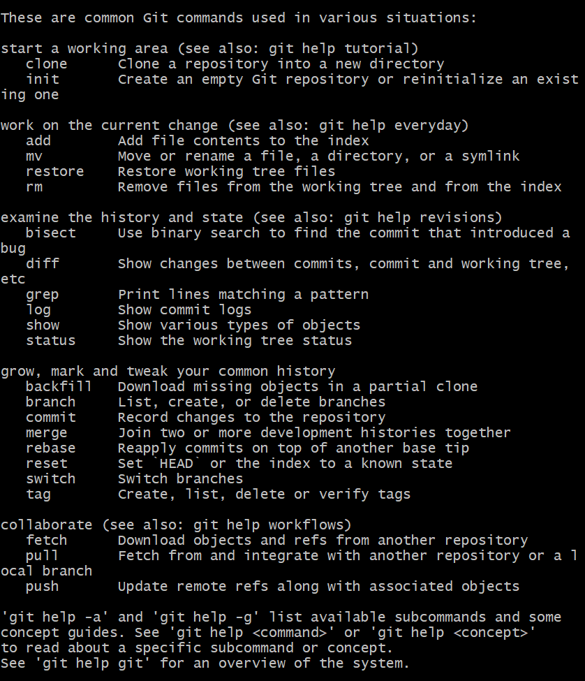

## Начало работы с новым проектом
Я создал файл `my_projects` и там же новый репозиторий. Затем в этом репозитории файл `README.md`, дерикторию `reports` и файл `reports/lab1.md`.

Основные синтаксические элементы языка Markdown, который используется для содержимого файлов `.md` [(Источник)](https://skillbox.ru/media/code/yazyk-razmetki-markdown-shpargalka-po-sintaksisu-s-primerami/#:~:text=*%20%D0%9D%D1%83%D0%BC%D0%B5%D1%80%D0%BE%D0%B2%D0%B0%D0%BD%D0%BD%D1%8B%D0%B5%20(ordered)%20*%20%D0%9D%D0%B5%D0%BD%D1%83%D0%BC%D0%B5%D1%80%D0%BE%D0%B2%D0%B0%D0%BD%D0%BD%D1%8B%D0%B5%20(unordered)%20*,%D0%92%D0%BB%D0%BE%D0%B6%D0%B5%D0%BD%D0%BD%D1%8B%D0%B5%20(nested)%20*%20%D0%94%D1%80%D1%83%D0%B3%D0%B8%D0%B5%20%D1%8D%D0%BB%D0%B5%D0%BC%D0%B5%D0%BD%D1%82%D1%8B%20%D0%B2%D0%BD%D1%83%D1%82%D1%80%D0%B8%20%D1%81%D0%BF%D0%B8%D1%81%D0%BA%D0%BE%D0%B2):
### Загловки
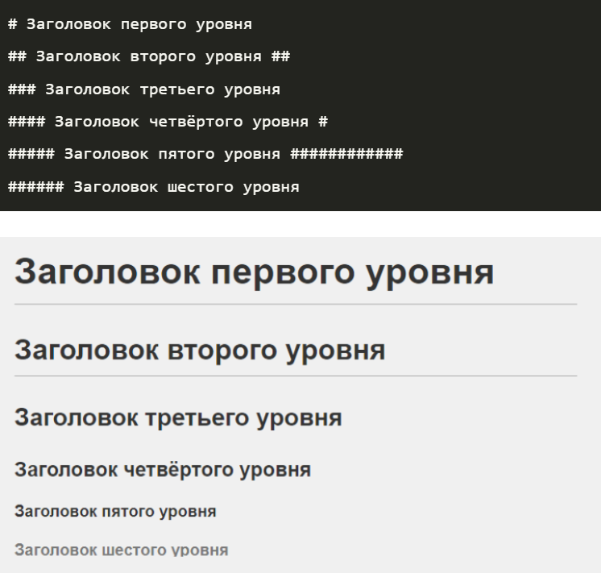
### Выделение текста
#### Курсив (italic)
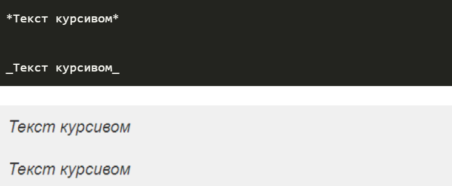
#### Жирный (bold)
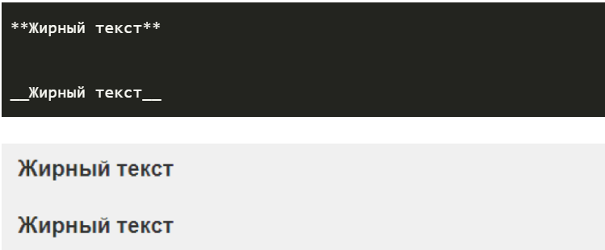
#### Жирный курсив (bold and italic)
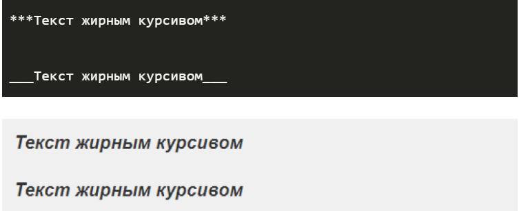
### Зачёркнутый
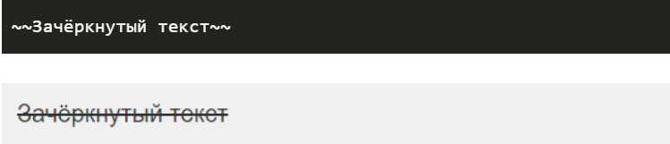
### Подчёркнутый
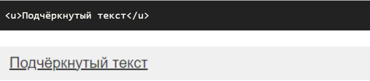
### Разделители 
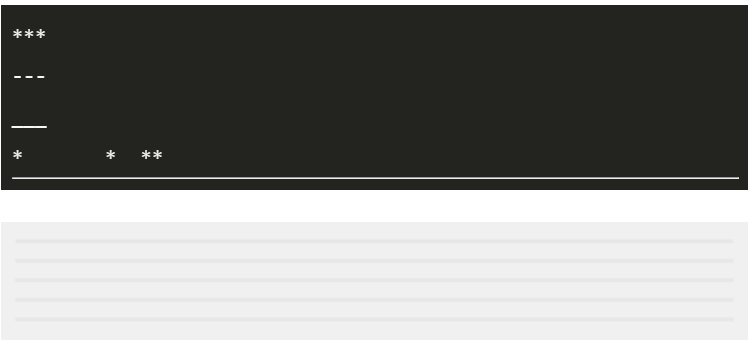
### Цитаты
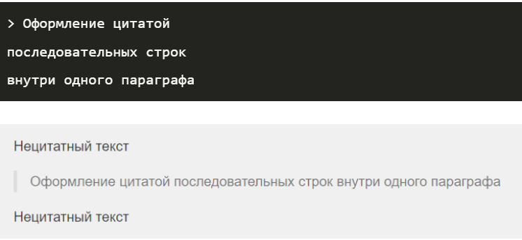
### Списки
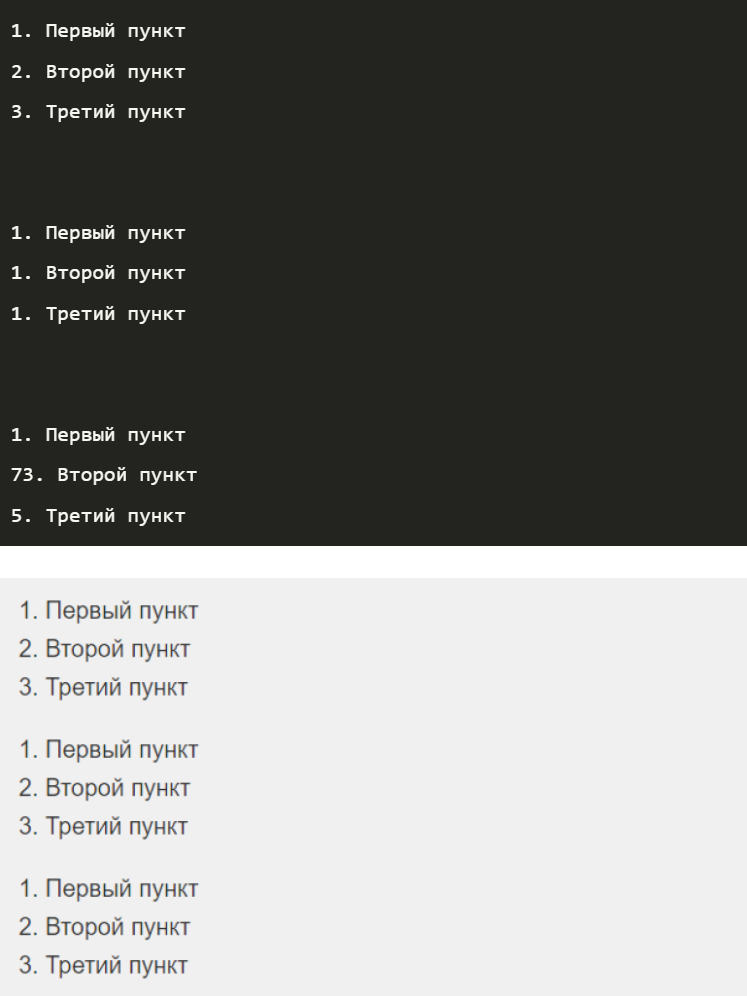
### Ссылки
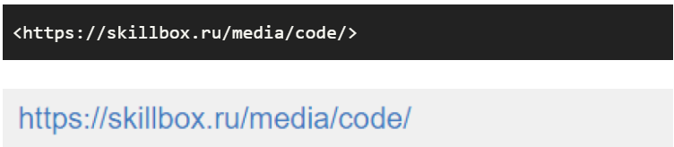
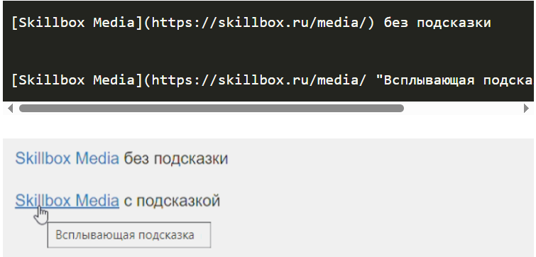
### Картинки
Изображения в Markdown оформляются по принципу, схожему с принципом оформления ссылкок, только перед квадратными скобками нужно поставить восклицательный знак.

Можно указать либо ссылку на изображение:  
\![Изображение]\(https://upload.wikimedia.org/wikipedia/commons/thumb/4/48/Markdown-mark.svg/1920px-Markdown-mark.svg.png "Логотип Markdown")

Либо путь к изображению:   
\![Screenshot_493.png]\(imgs/Screenshot_493.png)
### Вставка кода
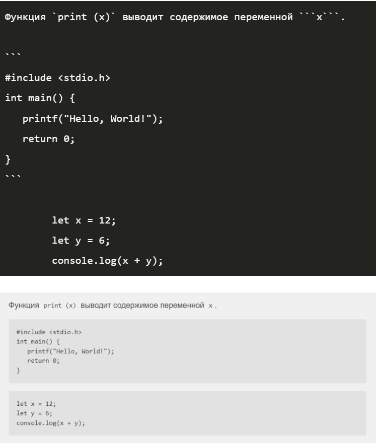
### Таблицы
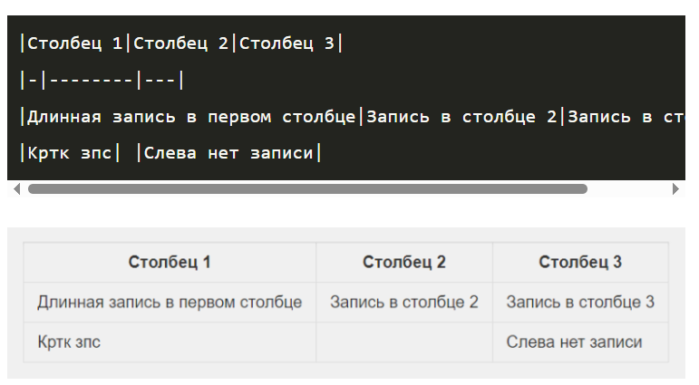

Написал в файле README.md заголовок, информацию о дисциплине и о себе. Создал коммит с файлами `README.md` и `reports/lab1.md`.

## Отслеживание состояния кода
**Команды:**
```bash
git status
git diff
```
**Вывод Команд:**
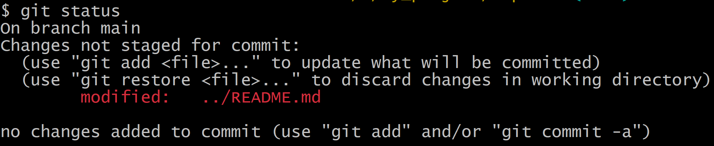
*Эта команда показывает текущее состояние рабочей директории и индекса. В данном случае нет изменений.*

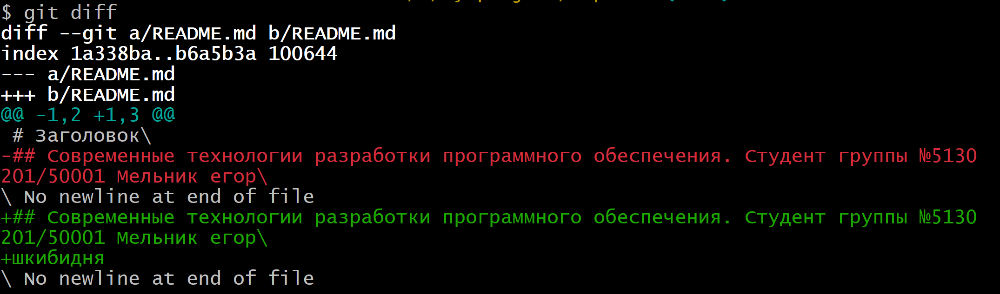
*Эта команда построчно сравнивает содержимое файлов. По умолчанию она показывает разницу между рабочей директорией и индексом. В данном случае нет изменений.*
***
Я внес заметки по предыдущим этапам в файл `reports/lab1.md`. При повторном использовании команды выводят:

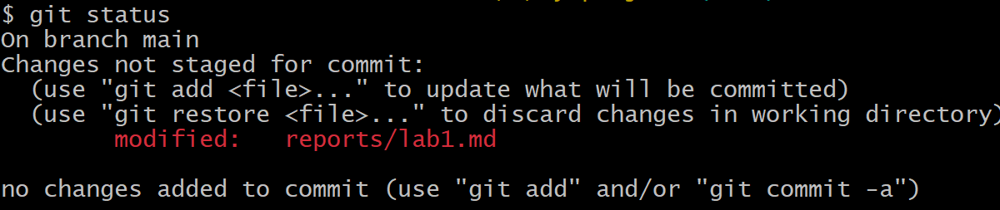
*Файл `lab1.md` изменен, но не добавлен в индекс.*

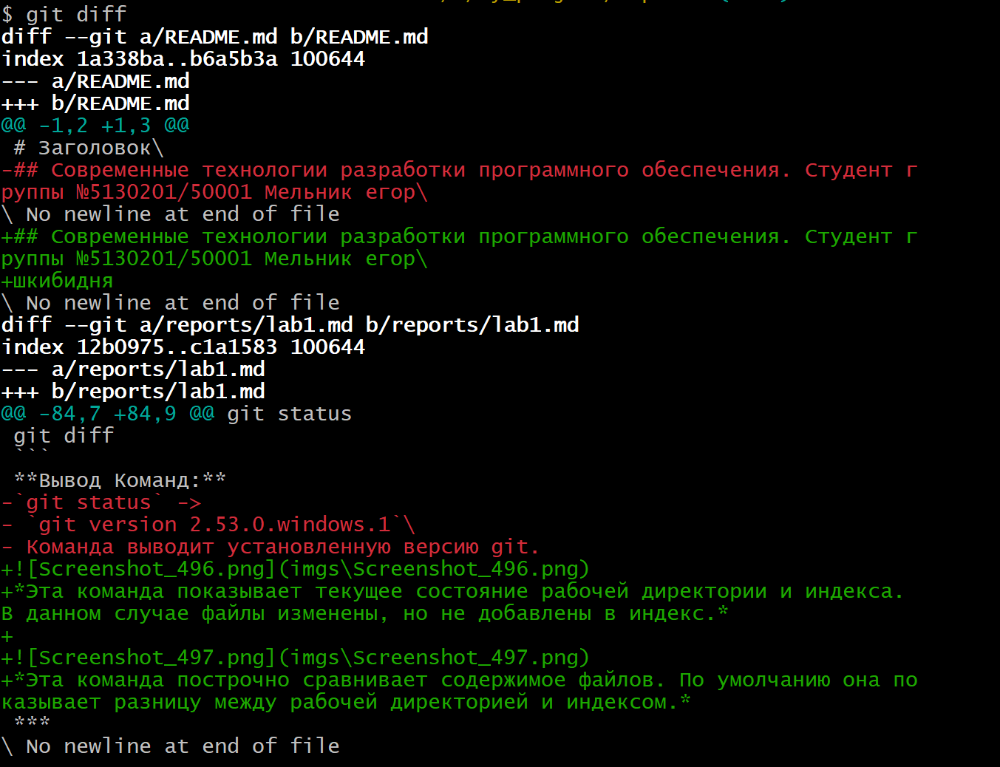
*Измениния в файле `lab1.md`*
***
C помощью команды `git add .` я добавил изменения в индекс. Теперь команда `git status` показывает:

 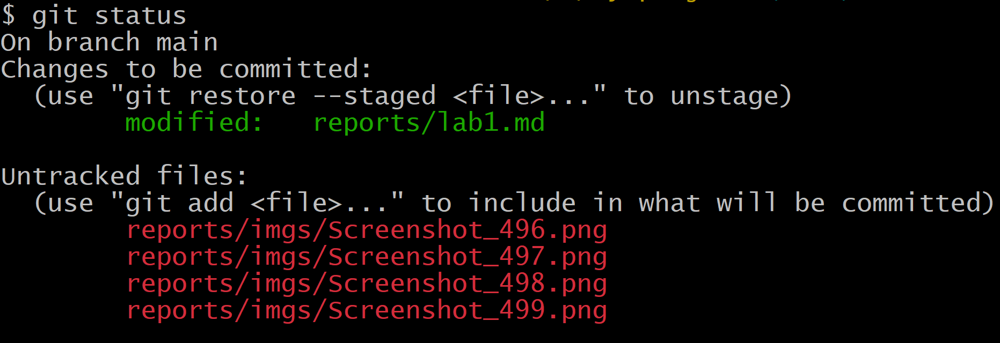
*Измениния находяться в индексе и их можно коммитить.*
***
Я внес изменения в файле `README.md` и команда `git diff README.md` показывает изменения сделанные только в этом файле: 

 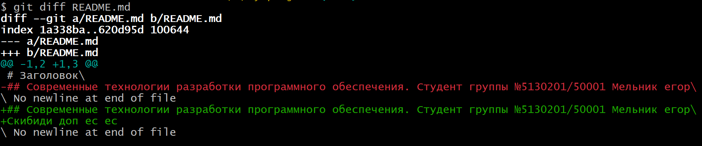

## Откат изменений

Я использовал команду `git restore` и измениня файла `README.md` пропали.

Я удалил файл `lab1.md` и ввел команду `git status`:

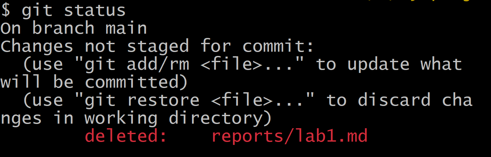
*Команда показывает то, что изменения произошли, а именно то, что файл был удален.*

Я его восстановил с помощью команды `git restore`.

## Ветвление версий

Я вывел имя текущей ветки с помощью команды `git branch` -> `main` и создал новую ветку `lab1-1` с помощью команды `git checkout`. 
Дополнил отчет и закомитил измения. 

Я внес изменения в файл `README.md`, но не закоммитил их. Попробовал переключиться на ветку `lab1-1`:

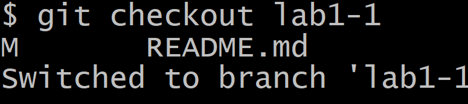
*Буква M (___Modified___) сообщает, что файл README.md был изменён в рабочей директории, но эти изменения не были закоммичены на предыдущей ветке.*

## Слияние веток, конфликты
Откатитл изменения в файле `README.md` и произвел слияние ветвей командой `git merge`. Поменял в заголовок в файле `README.md` и закоммитил изменения. Переключился на ветку `lab1-1` и внес изменения. 
Затем закоммитил их и попытался слить ветку `lab1-1` с `main`:

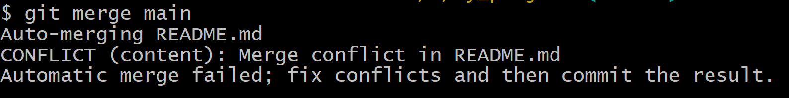
*Это значит, что и в ветке `main`, и `lab1-1` была изменена одна и та же строка в файле `README.md`. `Git` не знает, какой вариант правильный, и просит решить это вручную.*

Я разрешил конфликты и завершил слияние с помощью команды `git commit`. Удалил ветку `lab1-1` с помощью команды `git branch -d lab1-1`.

## Работа с удаленным репозиторием

Создал приватный репозиторий. Добавил этот репозиторий в качестве удаленного для моего локального репозитория командой `git remote add`. 
С помощью команды `git push` отправил данные из локального репозитория в удаленный. 

## Синхронизация с удаленным репозиторием

Я создал папку вне своего репозитория. Получил копию репозитория в этой папке с помощью `git clone`. Добавил в этом репозитории последние протоколы в свой отчет и закоммитьте их. Затем отправил эти изменения в удаленный репозиторий и вернулся в свой первый локальный репозиторий. Запросил обновления из удаленного репозитория с помощью `git fetch`:

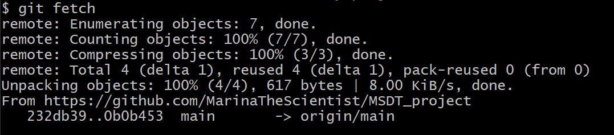
*`Git` обнаружил новые коммиты на сервере и скачал их в локальную базу данных. Локальный указатель `origin/main` передвинулся вперед на новые коммиты.* 

Синхронизировал содержимое репозитория для основной ветки с помощью команды `git pull origin main`. 

## История изменений

Получил сводку последних изменений с помощью `git log --oneline`:

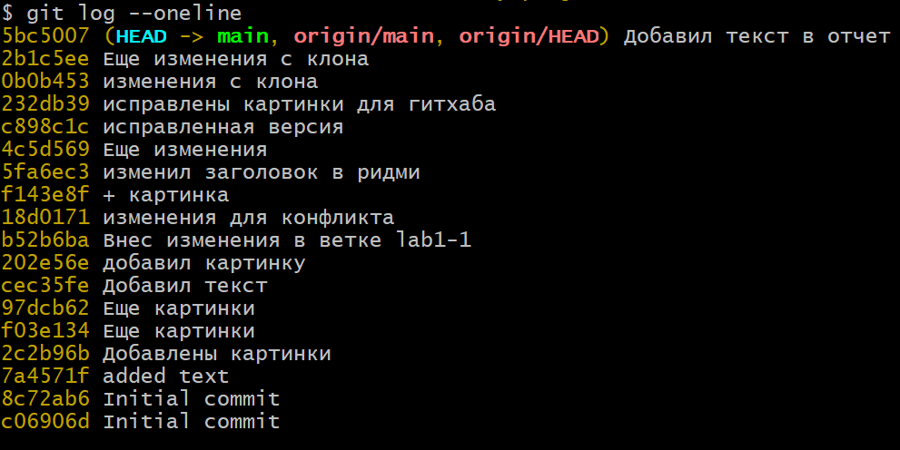
*(использовал параметр `--oneline` для компактности)*