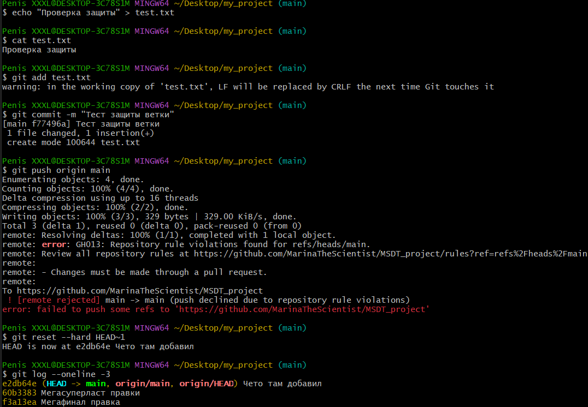
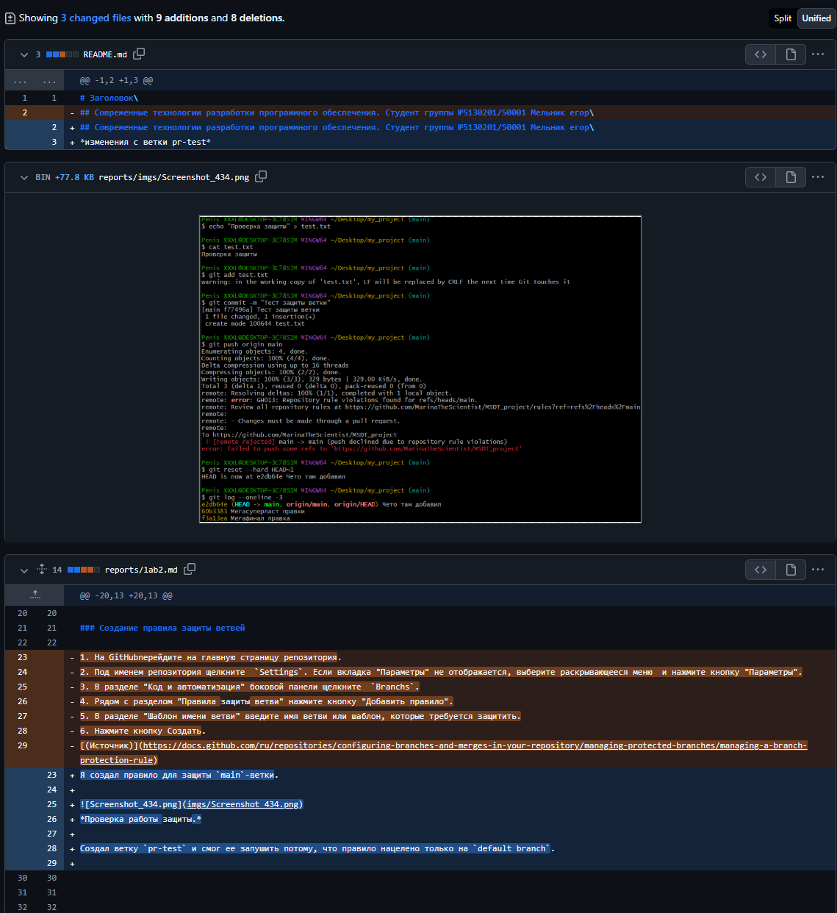
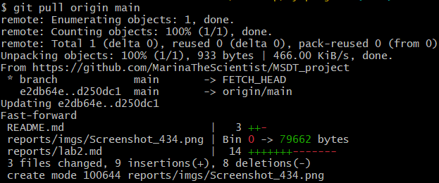

# Лабораторная работа №2. Git Flow, Code Review
**Студент:** Мельник Егор\
**Группа:** 5130201/50001\
**Цель работы:** Познакомиться с вариантом организации совместной работы над новой функциональностью и проведения инспекции кода.

## Содержание
1. [Подготовка репозитория](#подготовка-репозитория)
2. [Защита веток](#защита-веток)
3. [Запросы на слияние](#запросы-на-слияние)
4. [Code Review](#code-Review)

## Подготовка репозитория

Файл .gitignore — это текстовый файл, в котором перечисляются шаблоны имен файлов и папок, которые Git не должен отслеживать. Он нужен, чтобы не засорять репозиторий временными или личными файлами. Он работает, фильтруя файлы при git status и git add. [(Источник)](https://ru.stackoverflow.com/questions/546520/%D0%94%D0%BB%D1%8F-%D1%87%D0%B5%D0%B3%D0%BE-%D0%BD%D1%83%D0%B6%D0%B5%D0%BD-%D1%84%D0%B0%D0%B9%D0%BB-gitignore)

Создал файл .gitignore:
````
build/
out/
bin/
cmake-build-*/
*.o
*.obj
*.exe
*.out
.vscode/
.idea/
````

## Защита веток

Защита веток в GitHub — это механизм, запрещающий прямую отправку кода в критические ветки (например, main, develop), требующий обязательного прохождения тестов и ревью перед слиянием через Pull Request. Это обеспечивает стабильность кода, предотвращает случайное удаление веток и ограничивает принудительную отправку. 

### Создание правила защиты ветвей

Я создал правило для защиты `main`-ветки.


*Проверка работы защиты.*

Создал ветку `pr-test` и смог ее запушить потому, что правило нацелено только на `default branch`.


## Запросы на слияние


*Создал запрос на слияние.*


*Выполнил команду `git pull`.*


## Code Review 

````git
git branch prog-lab1
git push -u origin prog-lab1
git checkout prog-lab1
````