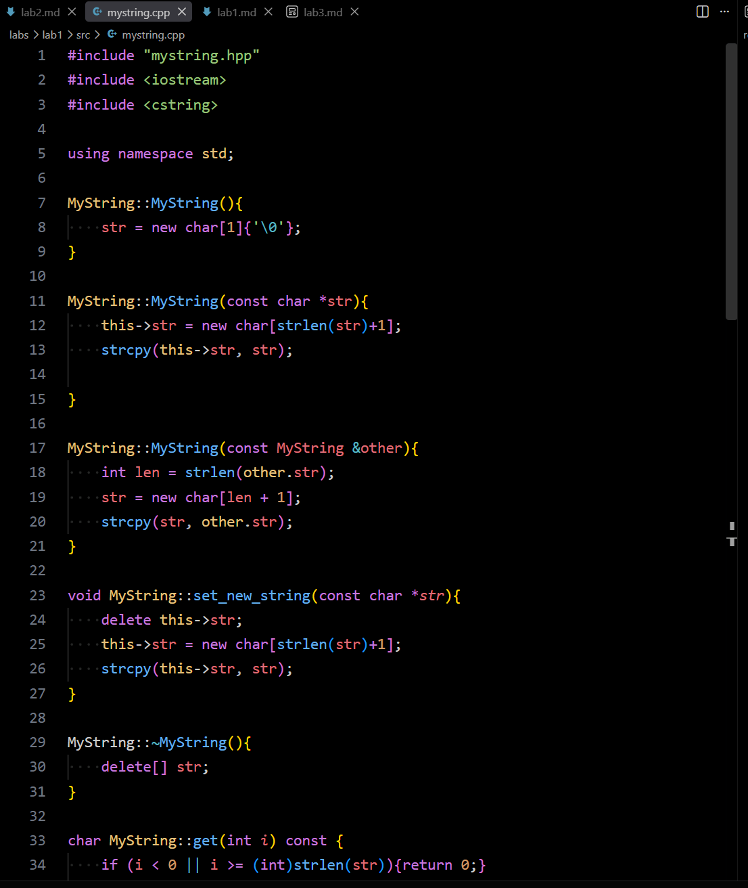
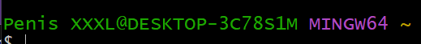
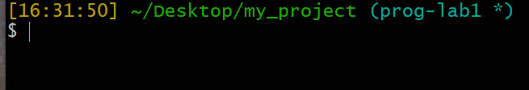
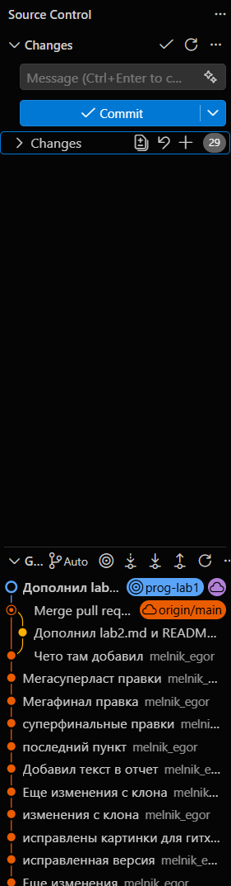

# Лабораторная работа №3. Настройка среды разработки
**Студент:** Мельник Егор\
**Группа:** 5130201/50001\
**Цель работы:** Познакомиться с базовыми приемами настройки своих инструментов разработки, с помощью которых он сможет удобнее настроить свои рабочие процессы под себя.

## Содержание
1. [Чем я пользуюсь?](#чем-я-пользуюсь?)
2. [Look and Feel](#look-and-Feel)
3. [Эргономика работы с кодом](#эргономика-работы-с-кодом)
4. [Кастомизация процессов](#кастомизация-процессов)
4. [Интеграция с гитом](#интеграция-с-гитом)

## Чем я пользуюсь?

| Задача | Программа |
|---------|----------|
| Редактирование текстовых файлов | VS Code |
| Программирование С++ | VS Code |
| Команды в консоли | Git Bash, PowerShell |
| Навигация по файлам | Проводник Windows |
| Работа с git | Git Bash |

Текстовые редакторы: Notepad++, Vim. Vim работает в терминале и управляется с клавиатуры через модальный ввод — быстро, но требует обучения.

Среды для C++: Visual Studio (полноценная IDE от Microsoft, лучший отладчик под Windows). VS Code формально не IDE, а редактор, который превращается в среду за счёт расширений.

Терминалы: Windows Terminal (вкладки, разделение окна, настройка через JSON).

Файловые менеджеры: Total Commander — двухпанельный, всё с клавиатуры, удобно копировать между папками.

Git-клиенты: GitHub Desktop, GitKraken(встраивается в контекстное меню Проводника).

## Look and Feel

### Цвета и шрифты

VS Code. Настройки хранятся в JSON-файле `settings.json`. Открывается через `Ctrl+Shift+P` → `Preferences: Open User Settings (JSON)`, либо графически по `Ctrl + ,`.

Есть два уровня настроек: User (глобальные, `%APPDATA%\Code\User\settings.json`) и Workspace (в папке `.vscode`/ внутри проекта). Workspace перекрывает User — так в каждом проекте могут действовать свои правила.

Тема выбирается через `Ctrl+K` `Ctrl+T` с живым превью, дополнительные ставятся из Marketplace (`Ctrl+Shift+X`). За тему отвечает ключ `workbench.colorTheme`.

Шрифт задаётся ключами `editor.fontFamily`, `editor.fontSize`, `editor.fontWeight`, `editor.fontLigatures`.

Git Bash(mintty). Правый клик по заголовку окна -> `Options`. Раздел `Looks` отвечает за цветовую схему и курсор, `Text` — за шрифт и его размер.

Источники: [code.visualstudio.com/docs/getstarted/themes](https://code.visualstudio.com/docs/getstarted/themes), [code.visualstudio.com/api/references/theme-color](https://code.visualstudio.com/api/references/theme-color), [страница про mintty на гитхабе](https://github.com/mintty/mintty/wiki/Tips).

### Что настроил

Изначально стояла тема по умолчанию со стандартным шрифтом. Полсе перешел на One Dark Modern Pro. Была какая-то неприятная "дымка" на экране, поэтому я вручную через `workbench.colorCustomizations` затемнил фон.


*Картинка из интернета, но все выглядело также.*


*После изменений.*

### Расположение элементов интерфейса

| Действие | Как |
|---------|----------|
| Боковая панель слева\справа | `Ctrl+Shift+P` -> `View: Toggle Primary Side Bar Position` |
| Нижняя панель вправо\влево | Правый клик по её заголовку -> `Move Panel Right` |
| Скрыть боковую панель | `Ctrl+B` |
| Скрыть нижнюю панель | `Ctrl+J` |

Иногда удобно скрывать нижнюю и боковую панели на `Ctrl+J` и `Ctrl+B` соответсвенно во время программирования. Попробовал поменять расположение боковой панели на лево и не понравилось, вернул как было. 

### Приглашение командной строки

В bash приглашение задаётся переменной PS1, которая читается из файла `~/.bashrc` при запуске оболочки. Есть также PS2 — приглашение продолжения для многострочных команд.

Управляющие последовательности:
| Действие | Как |
|---------|----------|
|\u|имя пользователя|
|\h|имя машины|
|\w|путь с ~ вместо домашней папки|
|\W|только имя текущей папки|
|\t|время ЧЧ:ММ:СС|
|\d|дата|

### Что настроил в приглашении

Стандартное приглашение Git Bash показывает `имя_пользователя@имя_машины MINGW64 путь`. Меня не устраивало две вещи: имя пользователя и машины постоянно занимают место и не несут пользы при работе на одном компьютере.


*До изменений.*


*После изменений.*

## Эргономика работы с кодом

### Горячие клавиши редактирования
|Сочетание  | Действие |
|---------|----------|
|Ctrl+Enter|вставить пустую строку ниже и перейти на неё, не уводя курсор в конец текущей|
|Ctrl+Shift+Enter|то же, но строкой выше|
|Ctrl+Shift+K|удалить строку целиком|
|Ctrl+D|выделить следующее такое же слово и поставить туда второй курсор|
|Ctrl+Shift+L|выделить сразу все вхождения слова под курсором|
|Ctrl+L|выделить строку|

### Навигация и рефакторинг

|Задача  |Способ |
|---------|----------|
|Поиск по содержимому файлов|Ctrl+Shift+F|
|Перейти к объявлению|F12|
|Перейти к реализации|Ctrl+F12|
|Найти все использования|Shift+F12|
|Переименовать везде|F2|
|Быстрое перемещение по коду|`Alt + <-` / `Alt + ->`|
|Комментирование блока|`Ctrl+/` — построчные `//`; `Shift+Alt+A` — блочный `/* */`|

## Кастомизация процессов

### Как устроенны горячие клавиши
Все сочетания VS Code хранит в файле `keybindings.json`. Открыть графический редактор — `Ctrl+K` `Ctrl+S`, оттуда кнопкой с иконкой файла в правом верхнем углу можно перейти к JSON.

````json
{
    "key": "",       // сочетание
    "command": "",   // команда
    "when": "",      // условие активности
    "args": {}       // аргументы, если команда их принимает
}
````
Привязать можно любую команду VS Code — то есть всё, что есть в палитре по `Ctrl+Shift+P`. Это несколько тысяч действий.

### Задачи сборки, запуска и тестов

Сборка, запуск и отладка настраиваются через файлы в директории `.vscode` в корне проекта: `tasks.json` описывает задачи, `launch.json` — конфигурацию отладчика.
Проект открыт в WSL, поэтому все задачи выполняются внутри Ubuntu, где установлены g++ и gdb.

Настроены пять задач, каждая вызывает соответствующую цель Makefile: сборка, запуск программы, автоматические тесты, проверка утечек памяти через AddressSanitizer и очистка каталога сборки. Сборка запускается по `Ctrl + Shift + B`, остальные задачи — через `Terminal` -> `Run Task` или своими сочетаниями клавиш: `F6` — запуск, `Ctrl + F6` — тесты, `Shift + F6` — проверка утечек.

## Интеграция с гитом

Интеграция с git в VS Code встроена изначально и находится во вкладке Source Control (Ctrl + Shift + G). Репозиторий в открытой папке обнаруживается автоматически.

Графический интерфейс представлен ниже. Вверху есть большая кнопка `commit`. Ниже этой кнопки находится вкладка changes, показывающая новые или модифицированные файлы. Ниже находится граф с историей версией. Справа от надписи `GRAPH` есть кнопки `fetch`, `push` и `pull`. Разрешение конфликтов при слиянии веток также можно проводить прямо в VS Code.



