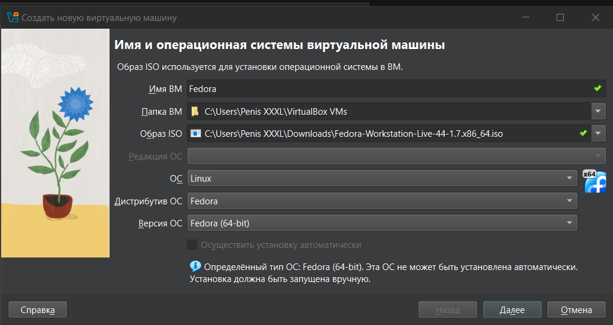
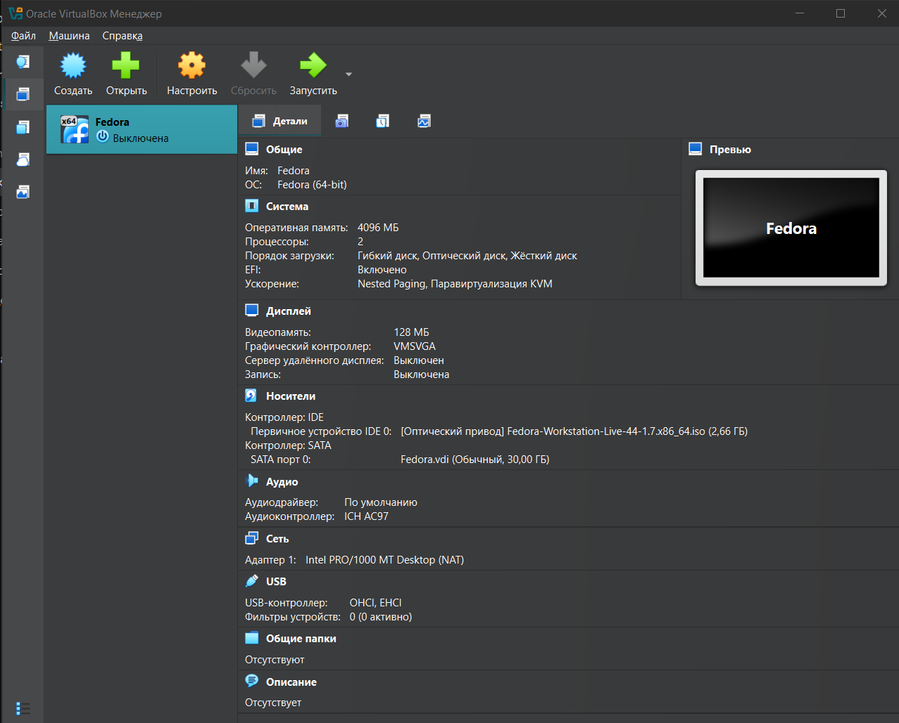
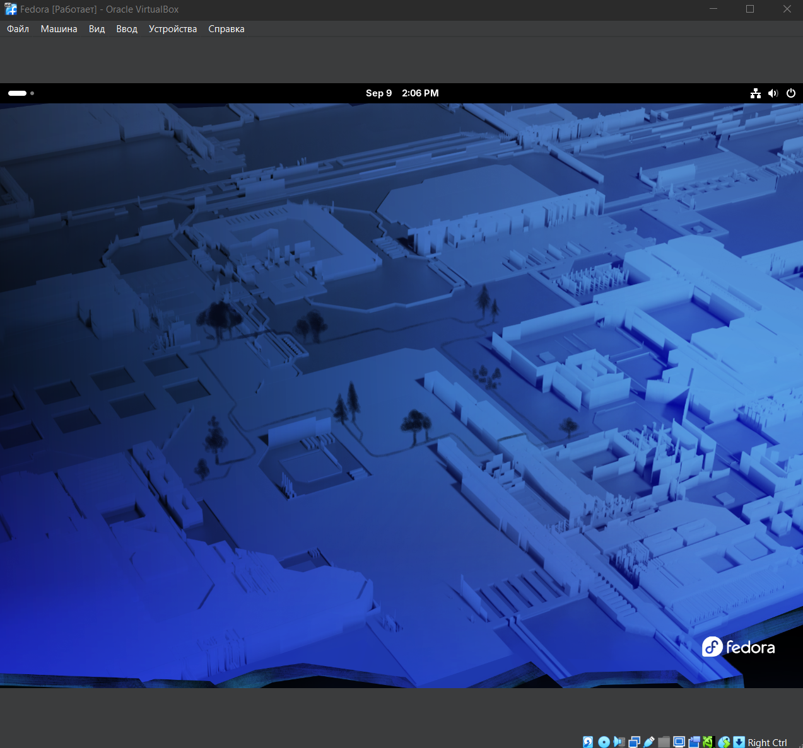
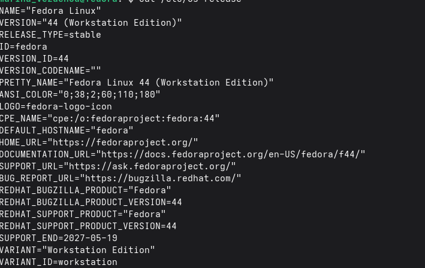
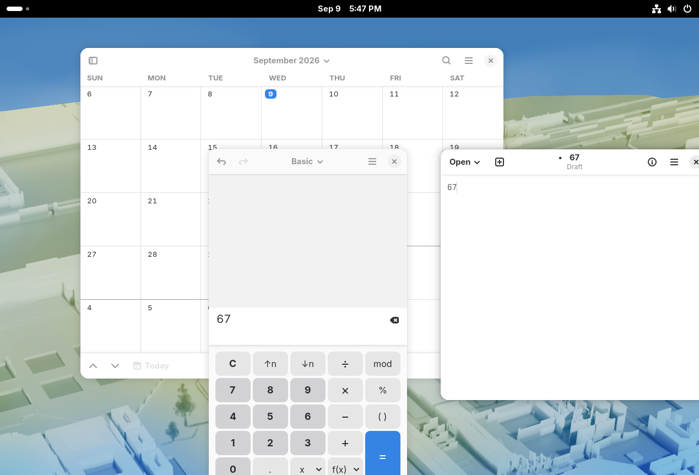
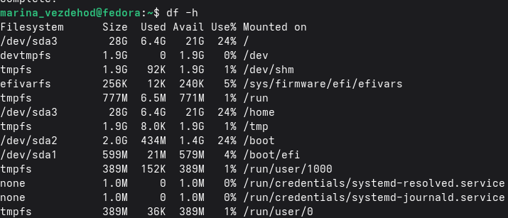
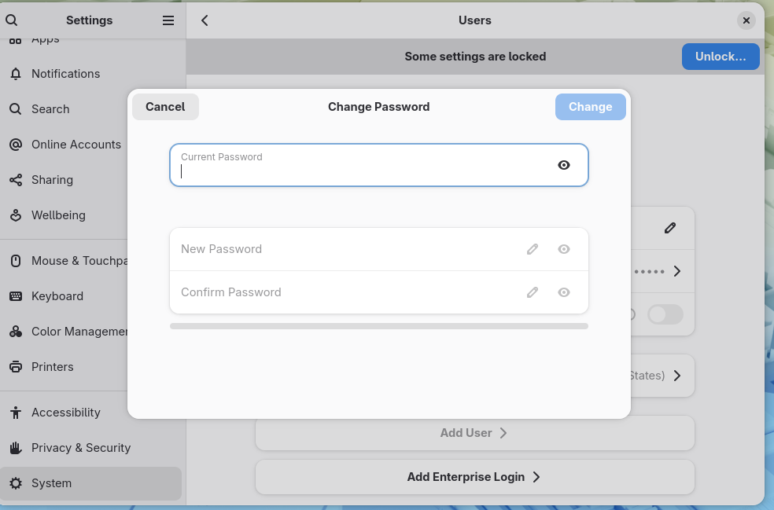
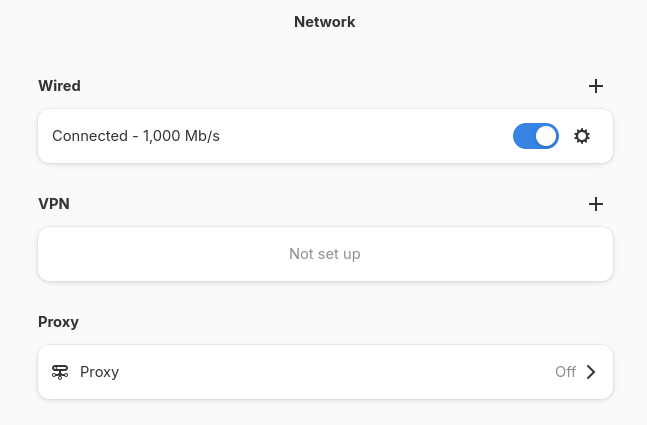
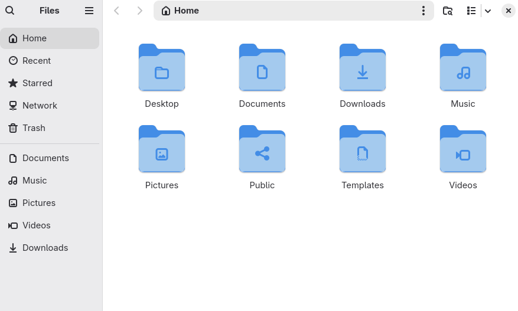
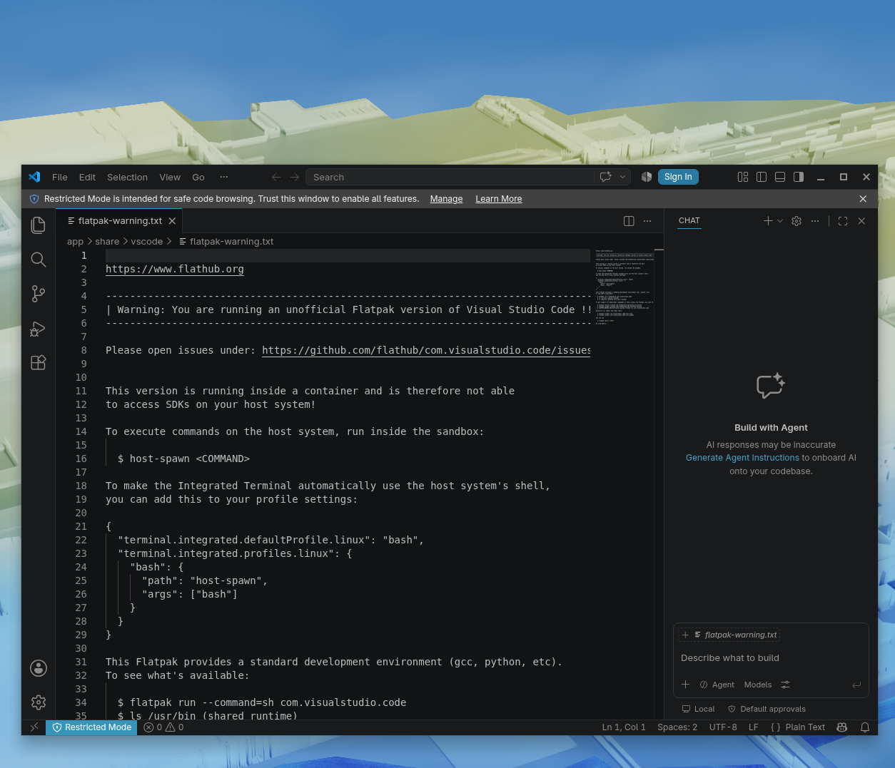

# Лабораторная работа №4. Знакомство с Linux
**Студент:** Мельник Егор\
**Группа:** 5130201/50001\
**Цель работы:** Познакомиться с базовой работой со средой Linux (установкой, настройкой, использованием) и простыми средствами виртуализации.

## Содержание
1. [Изучение особенностей дистрибутива](#изучение-особенностей-дистрибутива)
2. [Установка ОС](#установка-ос)
3. [Настройка и установка пакетов](#настройка-и-установка-пакетов)

## Изучение особенностей дистрибутива
### Вариант: Fedora + GNOME (простой вариант, код F).

### Общие сведения

***Разработчик.*** Fedora Project — сообщество разработчиков, спонсируемое компанией Red Hat (с 2019 года входит в IBM). Red Hat оплачивает инфраструктуру и труд части разработчиков, но решения принимает выборный совет сообщества — FESCo.

***Базовый дистрибутив.*** Fedora самостоятельна, ни на чём не основана. Наоборот, она сама служит основой: именно на её наработках строится Red Hat Enterprise Linux, а из RHEL происходят CentOS Stream, Rocky Linux и AlmaLinux. Фактически Fedora — это полигон, где новые технологии обкатываются перед попаданием в корпоративные системы. Systemd, Wayland и PipeWire пришли в массовые дистрибутивы именно через неё.

***Цикл релизов.*** Новая версия выходит примерно раз в полгода, обычно в апреле и октябре. Каждая версия поддерживается около 13 месяцев — то есть до выхода двух следующих плюс месяц. Долгосрочной поддержки (LTS) у Fedora нет принципиально: дистрибутив ориентирован на свежий софт, а не на многолетнюю стабильность.

Ресурсы для изучения:

- [docs.fedoraproject.org](https://docs.fedoraproject.org) — официальная документация
- [fedoraproject.org/wiki](https://fedoraproject.org/wiki) — вики сообщества

### Пакетный менеджер
Fedora использует формат пакетов RPM и менеджер DNF (Dandified YUM), с пятой версии — DNF5, переписанный на C++ и заметно более быстрый.

Основные команды:
|Сочетание  | Действие |
|---------|----------|
|dnf search <текст>|поиск пакета по названию и описанию|
|sudo dnf install <пакет>|установка|
|sudo dnf remove <пакет>|удаление|
|sudo dnf upgrade|обновление всех пакетов|
|dnf list installed|список установленных|
|dnf info <пакет>|подробности о пакете|
|sudo dnf autoremove|удаление осиротевших зависимостей|
|dnf history|журнал операций|

### Процесс установки Fedora
Установщик Fedora называется Anaconda, интерфейс графический. Порядок такой([инструкция](https://fedoraproject.org/wiki/Fedora_Quick_Install_Guide)):

1. Скачать ISO-образ Fedora Workstation с [fedoraproject.org](https://fedoraproject.org/)
2. Загрузиться с него — система стартует в Live-режиме, где её можно попробовать без установки
3. Запустить «Install to Hard Drive» с рабочего стола
4. Выбрать язык и раскладку
5. Указать диск для установки; для виртуальной машины подойдёт автоматическая разметка
6. Дождаться копирования файлов
7. После перезагрузки пройти первичную настройку: создать пользователя, задать пароль

По [официальной документации](https://docs.fedoraproject.org/en-US/workstation-docs/) Fedora Workstation для комфортной работы рекомендуется 4 ГБ оперативной памяти и 40 ГБ на SSD, при этом допускается запуск и на более слабом оборудовании. Образы доступны для архитектур x86_64 и aarch64, то есть поддерживаются процессоры Intel, AMD и ARM.

## Установка ОС

*Создание виртуалной машины*

*Характеристики*

*Все получилось*

## Настройка и установка пакетов

*Несколько окон*

*Отслеживание системных ресурсов*

*Смена пароля(в настройках)*

*Настройка сетевых подключений(в настройках)*

*Работа с файловой системой*

*Установил VS CODE*