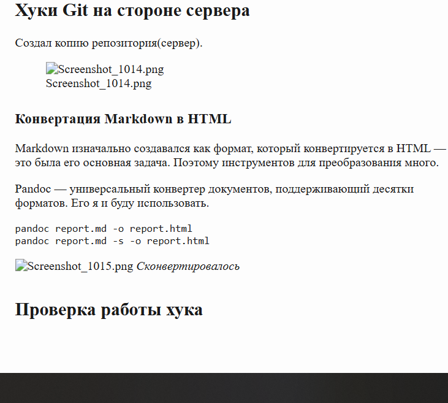
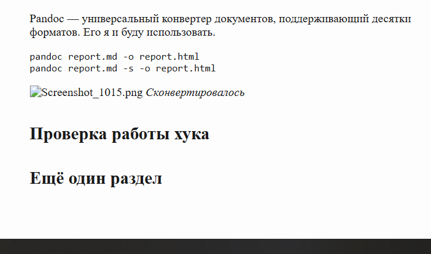
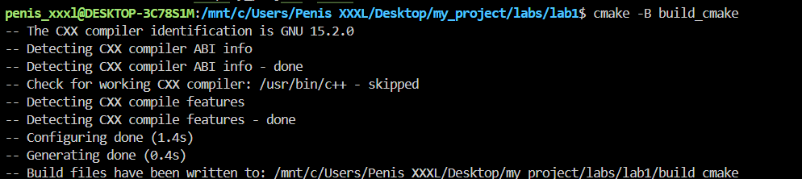
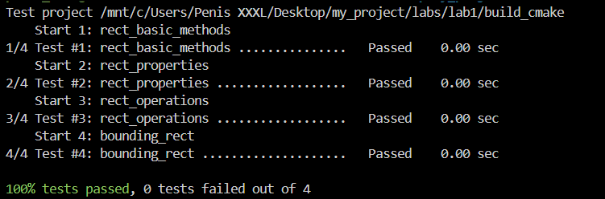
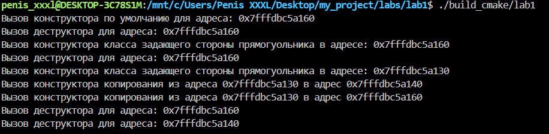
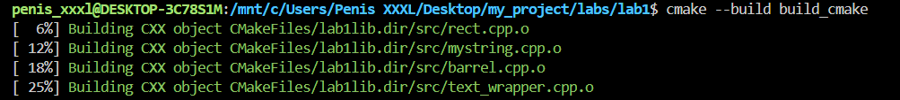

# Лабораторная работа №6. Простые CI-CD пайплайны
**Студент:** Мельник Егор\
**Группа:** 5130201/50001\
**Цель работы:** Познакомиться с простыми средствами автоматизации процесса задач разработки в рамках работы с системой контроля версий.

## Содержание
1. [Базовые хуки в Git на стороне клиента](#базовые-хуки-в-git-на-стороне-клиента)
2. [Хуки Git на стороне сервера](#хуки-git-на-стороне-сервера)
3. [Сборка с помощью CMake](#сборка-с-помощью-cmake)
4. [Автоматизация задач CMake в git](#автоматизация-задач-cmake-в-git)
5. [Автоматизация с помощью Github Actions](#автоматизация-с-помощью-github-actions)

## Базовые хуки в Git на стороне клиента

Git-хуки — это исполняемые скрипты, которые Git автоматически запускает при определённых событиях. Лежат в `.git/hooks/`. Чтобы хук заработал, файл нужно назвать точно (без расширения) и сделать исполняемым.

Хуки с префиксом `pre-` и `commit-msg` могут остановить операцию, с префиксом `post-` — нет, они запускаются, когда всё уже произошло.

Хук `pre-commit`(проверяет наличие запрещенных слов)
````git
#!/bin/bash

if git diff --cached | grep -qiE "password|api_key|token|PRIVATE KEY"; then
    echo "ОШИБКА: в изменениях найдены секретные данные!"
    exit 1
fi

echo "Проверка на отсуствие наличия секретных данных пройдена."
exit 0
````


Хук `commit-msg`(проверяет сообщение коммита)
````git
#!/bin/bash

MSG=$(cat "$1")

if ! echo "$MSG" | grep -qE "^(feat|fix|docs|test): "; then
    echo "ОШИБКА: сообщение должно начинаться с feat:, fix:, docs: или test:"
    exit 1
fi

echo "Проверка сообщения коммита пройдена."
exit 0
````


## Хуки Git на стороне сервера

Создал копию репозитория(сервер).


### Конвертация Markdown в HTML

Markdown изначально создавался как формат, который конвертируется в HTML — это была его основная задача. Поэтому инструментов для преобразования много.

Pandoc — универсальный конвертер документов, поддерживающий десятки форматов. Его я и буду использовать.
````git
pandoc report.md -o report.html
pandoc report.md -s -o report.html
````


*Сконвертировалось*

Хукецкий:
````git
#!/bin/bash

BRANCH="lab6"
REPO_DIR="$HOME/Desktop/server_repo.git"
OUT_DIR="$HOME/Desktop/html_output"

while read oldrev newrev refname; do
    if [ "$refname" = "refs/heads/$BRANCH" ]; then
        echo "Получены изменения в ветке $BRANCH, собираю HTML..."

        mkdir -p "$OUT_DIR"

        git --git-dir="$REPO_DIR" show "$BRANCH:reports/lab6.md" > /tmp/lab6.md

        pandoc /tmp/lab6.md -s -o "$OUT_DIR/lab6.html"

        echo "Готово: $OUT_DIR/lab6.html"
    fi
done
````

*Сконвертировалось*


*Сконвертировалось*

## Сборка с помощью CMake

CMake - генератор систем сборки. Make описывает конкретные команды компиляции для конкретной системы, поэтому Makefile, написанный под Linux и g++, не соберёт проект в Windows под MSVC. CMake работает уровнем выше: программист описывает структуру проекта — какие есть библиотеки, исполняемые файлы и связи между ними, — а CMake сам генерирует файлы сборки под текущую платформу: Makefile в Linux, проект Visual Studio в Windows, файлы Ninja где угодно.

Проект — верхний уровень описания, объявляется в корневом файле:
```cmake
cmake_minimum_required(VERSION 3.10)
project(Lab1 VERSION 1.0 LANGUAGES CXX)
```
*Первая строка задаёт минимальную версию CMake и обязательна. Вторая объявляет имя проекта, версию и используемые языки (`CXX` означает C++).*

Цель (target) — то, что требуется построить. Целью может быть библиотека, исполняемый файл или служебное действие. Современный подход к CMake строится именно вокруг целей: все свойства — флаги, пути, зависимости — назначаются конкретной цели, а не всему проекту сразу.

Исполняемый файл:

```cmake
add_executable(lab1 src/lab1.cpp)
```
Библиотека:
```cmake
add_library(lab1lib STATIC src/rect.cpp src/matrix.cpp)
```
*Второй аргумент задаёт тип: STATIC — статическая (код встраивается в программу при линковке), SHARED — динамическая (подключается во время выполнения), INTERFACE — без собственного кода, только заголовки.*


*Сконвертировалось*

*Сконвертировалось*

*Сконвертировалось*

*Сконвертировалось*

## Автоматизация задач CMake в git

