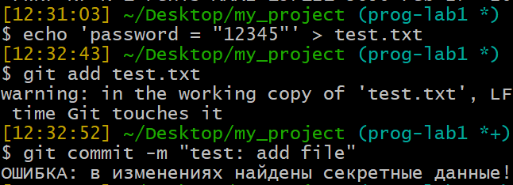
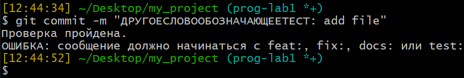
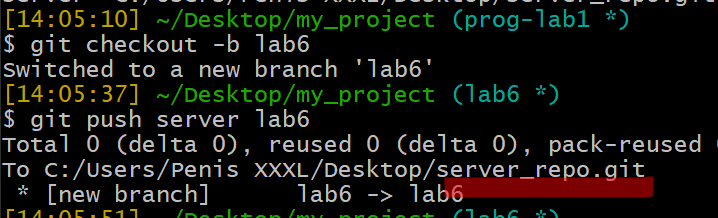
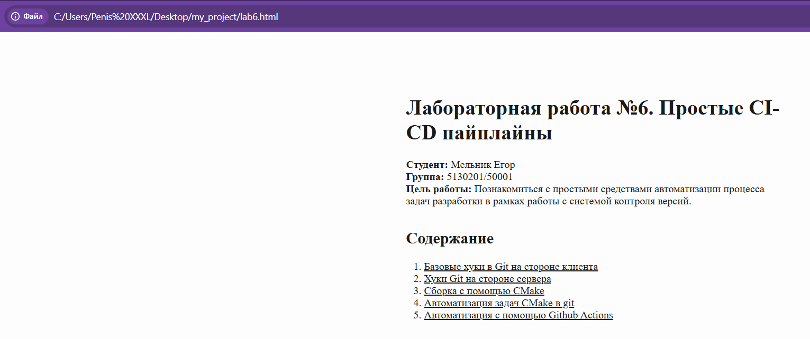

# Лабораторная работа №6. Простые CI-CD пайплайны
**Студент:** Мельник Егор\
**Группа:** 5130201/50001\
**Цель работы:** Познакомиться с простыми средствами автоматизации процесса задач разработки в рамках работы с системой контроля версий.

## Содержание
1. [Базовые хуки в Git на стороне клиента](#базовые-хуки-в-git-на-стороне-клиента)
2. [Хуки Git на стороне сервера](#хуки-git-на-стороне-сервера)
3. [Сборка с помощью CMake](#сборка-с-помощью-cmake)
4. [Автоматизация задач CMake в git](#автоматизация-задач-cmake-в-git)
5. [Автоматизация с помощью Github Actions](#автоматизация-с-помощью-github-actions)

## Базовые хуки в Git на стороне клиента

Git-хуки — это исполняемые скрипты, которые Git автоматически запускает при определённых событиях. Лежат в `.git/hooks/`. Чтобы хук заработал, файл нужно назвать точно (без расширения) и сделать исполняемым.

Хуки с префиксом `pre-` и `commit-msg` могут остановить операцию, с префиксом `post-` — нет, они запускаются, когда всё уже произошло.

Хук `pre-commit`(проверяет наличие запрещенных слов)
````git
#!/bin/bash

if git diff --cached | grep -qiE "password|api_key|token|PRIVATE KEY"; then
    echo "ОШИБКА: в изменениях найдены секретные данные!"
    exit 1
fi

echo "Проверка на отсуствие наличия секретных данных пройдена."
exit 0
````


Хук `commit-msg`(проверяет сообщение коммита)
````git
#!/bin/bash

MSG=$(cat "$1")

if ! echo "$MSG" | grep -qE "^(feat|fix|docs|test): "; then
    echo "ОШИБКА: сообщение должно начинаться с feat:, fix:, docs: или test:"
    exit 1
fi

echo "Проверка сообщения коммита пройдена."
exit 0
````


## Хуки Git на стороне сервера

Создал копию репозитория(сервер).



### Конвертация Markdown в HTML

Markdown изначально создавался как формат, который конвертируется в HTML — это была его основная задача. Поэтому инструментов для преобразования много.

Pandoc — универсальный конвертер документов, поддерживающий десятки форматов. Его я и буду использовать.
````git
pandoc report.md -o report.html
pandoc report.md -s -o report.html
````


*Сконвертировалось*


## Проверка работы хука
