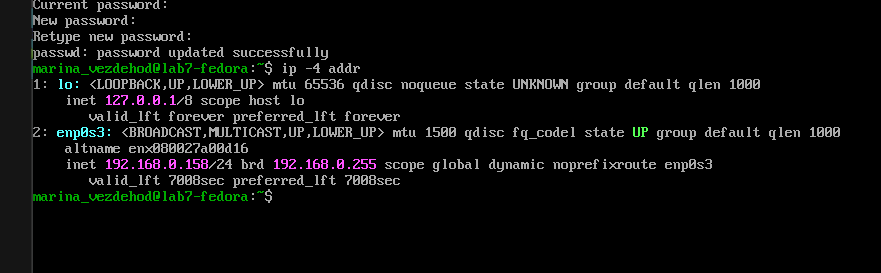
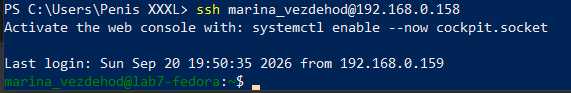
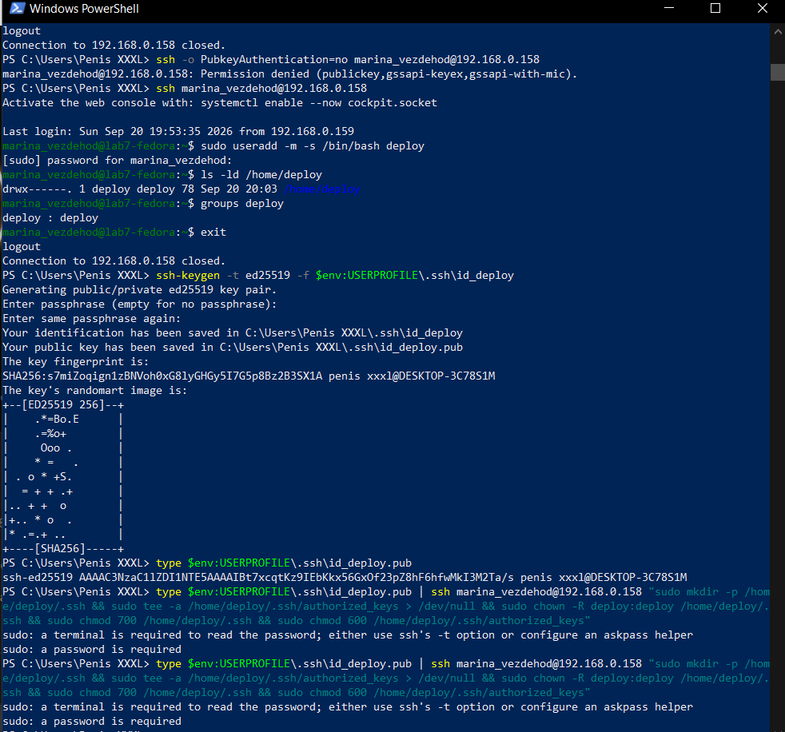
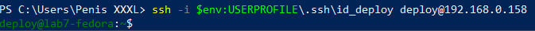
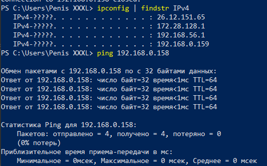
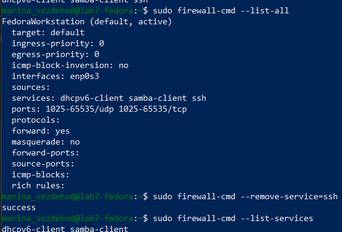
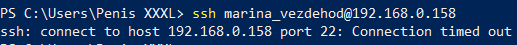
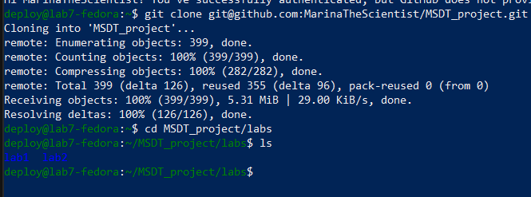
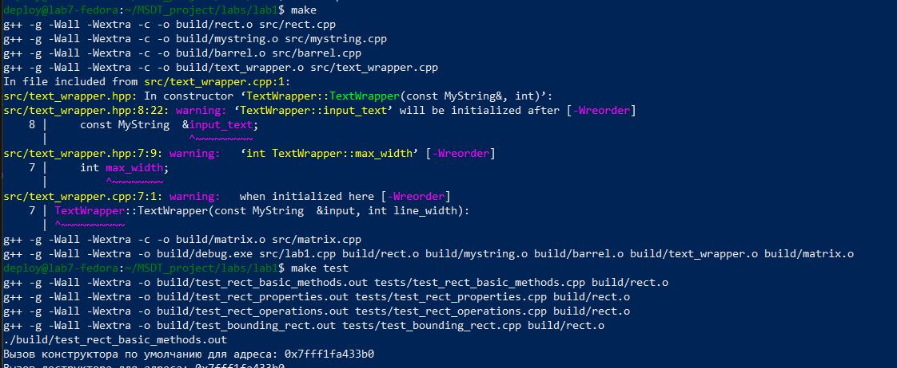
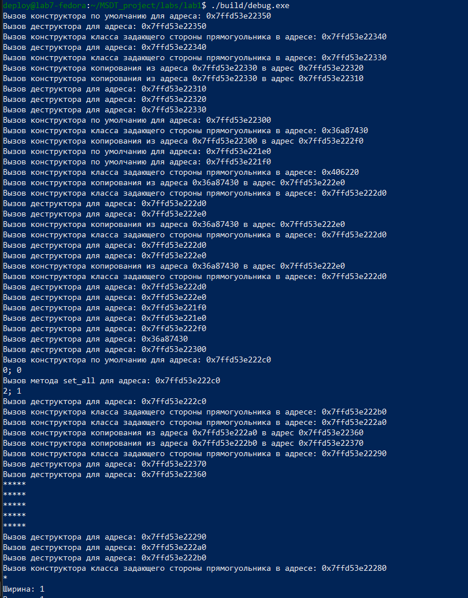

# Лабораторная работа №7. Развертывание на целевой машине
**Студент:** Мельник Егор\
**Группа:** 5130201/50001\
**Цель работы:** Познакомиться с простым сценарием подготовки целевой машины и доставки программного продукта на нее.

## Содержание
1. [Создание виртуальной машины](#создание-виртуальной-машины)
2. [Настройка удаленного доступа](#настройка-удаленного-доступа)
3. [Настройка сессии для другого пользователя](#настройка-сессии-для-другого-пользователя)
4. [Развертывание программы](#развертывание-программы)

Работа выполнена индивидуально, напарника найти не удалось. Роль напарника играет отдельный пользователь `deploy` на виртуальной машине со своей парой SSH-ключей, роль его компьютера — основная система (Windows, 192.168.0.159). ВМ: Fedora 44, 192.168.0.158, администратор `marina_vezdehod`.

## Создание виртуальной машины

Дистрибутив: Fedora (вариант F из работы №4). Платформа: VirtualBox.

WSL не выбран: он монтирует диски Windows в /mnt/c, и посторонний пользователь получил бы доступ к файлам основной системы.

Опасности доступа постороннего к ВМ. Пользователь видит все файлы, которые ему разрешено читать: конфигурации в /etc, логи, а при неправильных правах — чужие домашние каталоги с документами и SSH-ключами. При наличии прав sudo (группа wheel) он получает полный контроль над системой. Также он расходует ресурсы ВМ и может работать в её сети, которая в режиме моста совпадает с моей локальной сетью. Поэтому: общие папки и общий буфер обмена VirtualBox отключены, ВМ склонирована из работы №4 (без личных файлов), пользователь-напарник создан без прав sudo.

ВМ настроена на сетевой мост и переведена в консольный режим без графической среды:

````bash
sudo hostnamectl set-hostname lab7-fedora
sudo systemctl set-default multi-user.target
sudo reboot
````



## Настройка удаленного доступа

Сервер OpenSSH в Fedora уже установлен, службу достаточно включить:

````bash
sudo systemctl enable --now sshd
````

TCP-порт — число от 0 до 65535, которое вместе с IP-адресом определяет, какой программе адресовано соединение. За SSH закреплён порт 22.

Проброс портов — перенаправление соединений с одного адреса и порта на другой. Например, в режиме NAT у ВМ нет своего адреса в локальной сети, и в VirtualBox настраивают правило «порт 2222 хоста → порт 22 ВМ». Здесь используется сетевой мост: ВМ имеет собственный адрес в сети, поэтому проброс не нужен.

Вход по ключу. Приватный ключ хранится только на клиенте, публичный записывается на сервере в ~/.ssh/authorized_keys. Сервер присылает случайные данные, клиент подписывает их приватным ключом, сервер проверяет подпись публичным — пароль по сети не передаётся.

````powershell
ssh-keygen -t ed25519
type $env:USERPROFILE\.ssh\id_ed25519.pub | ssh marina_vezdehod@192.168.0.158 "mkdir -p ~/.ssh && chmod 700 ~/.ssh && cat >> ~/.ssh/authorized_keys && chmod 600 ~/.ssh/authorized_keys"
ssh marina_vezdehod@192.168.0.158
````



Отключение входа по паролю. В Fedora этот параметр перекрывается файлами из /etc/ssh/sshd_config.d/, поэтому создан собственный файл с более высоким приоритетом:

````bash
echo "PasswordAuthentication no" | sudo tee /etc/ssh/sshd_config.d/01-lab7.conf
sudo sshd -T | grep -i passwordauthentication
sudo systemctl restart sshd
````

## Настройка сессии для другого пользователя

````bash
sudo useradd -m -s /bin/bash deploy
groups deploy
````

На скриншоте также видна проверка запрета входа по паролю: ssh -o PubkeyAuthentication=no возвращает Permission denied (publickey).



Публичный ключ «напарника» (отдельная пара id_deploy) размещён в его домашнем каталоге:

````bash
sudo cp /tmp/deploy.pub /home/deploy/.ssh/authorized_keys
sudo chown -R deploy:deploy /home/deploy/.ssh
sudo chmod 700 /home/deploy/.ssh
sudo chmod 600 /home/deploy/.ssh/authorized_keys
sudo restorecon -R /home/deploy/.ssh
````

Права 700 и 600 обязательны: при более свободных правах sshd игнорирует authorized_keys.



Локальная сеть. Обе машины в одной сети, доступность проверена ping.



Открытие и закрытие порта. В Fedora этим управляет firewalld; команды без --permanent действуют до перезагрузки, что удобно для временного доступа.

````bash
sudo firewall-cmd --remove-service=ssh
sudo firewall-cmd --add-service=ssh
````



Постоянно открытый порт 22 в общей сети опасен: он становится целью автоматического перебора паролей, поэтому после работы прежние настройки возвращены.

## Развертывание программы

Необходимые программы: git, компилятор g++, система сборки make. Все уже присутствовали на целевой машине, установка не потребовалась.

Доступ к репозиторию. Копировать приватный ключ на чужую машину нельзя: владелец машины может его прочитать и получить доступ ко всем моим репозиториям. Безопасные варианты — Deploy Key (ключ на один репозиторий) или SSH Agent Forwarding. Выбран второй: ключ остаётся на моей машине, а удалённая сессия лишь обращается к локальному агенту за подписью.

````powershell
ssh-add $env:USERPROFILE\.ssh\id_ed25519
ssh -A -i $env:USERPROFILE\.ssh\id_deploy deploy@192.168.0.158
````
````bash
ssh -T git@github.com
git clone git@github.com:MarinaTheScientist/MSDT_project.git
````



### Сборка и тесты.

````bash
cd MSDT_project/labs/lab1
mkdir -p build
make
make test
./build/debug.exe
````

